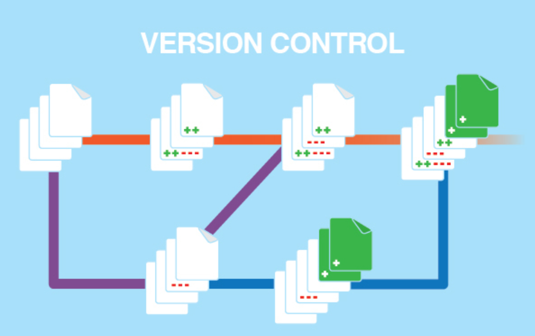

#########
GitHub
#########

Introduction to Version Control System
----------------------------------------

A version control system is a special application that stores and manages every revision of your files and code. Many developers and 
organizations use version control to collaborate on source code, manage releases, and roll back to previous versions when bugs are 
discovered.
Setting up a version control system is easy. The hard part is learning to use it, and then incorporate it in your daily workflow.

   
Need of Version Controlling
---------------------------

- Collaboration

Without a VCS in place, you're probably working together in a shared folder on the same set of files. Shouting through the office that you 
are currently working on file "xyz" and that, meanwhile, your teammates should keep their fingers off is not an acceptable workflow. It's 
extremely error-prone as you're essentially doing open-heart surgery all the time: sooner or later, someone will overwrite someone else's 
changes.

With a VCS, everybody on the team is able to work absolutely freely - on any file at any time. The VCS will later allow you to merge all 
the changes into a common version. There's no question where the latest version of a file or the whole project is. It's in a common, 
central place: your version control system.

- Storing Versions (Properly)

Saving a version of your project after making changes is an essential habit. But without a VCS, this becomes tedious and confusing.
A version control system acknowledges that there is only one project. Therefore, there's only the one version on your disk that you're 
currently working on. Everything else - all the past versions and variants - are neatly packed up inside the VCS. When you need it, you can
request any version at any time and you'll have a snapshot of the complete project right at hand.

- Restoring Previous Versions

Being able to restore older versions of a file (or even the whole project) effectively means one thing: you can't mess up! If the changes
you've made lately prove to be garbage, you can simply undo them in a few clicks. Knowing this should make you a lot more relaxed when
working on important bits of a project.

- Backup

A side-effect of using a distributed VCS like Git is that it can act as a backup; every team member has a full-blown version of the 
project on his disk - including the project's complete history. Should your beloved central server break down (and your backup drives 
fail), all you need for recovery is one of your teammates' local Git repository.

Version Controlling Tools
--------------------------

Following are the different version controlling tools:

1) Git

Git is one of the best version control tools that is available in the present market.It is open source tool.

- Pros:

    1) Super-fast and efficient performance.
    2) Cross-platform
    3) Code changes can be very easily and clearly tracked.
    4) Easily maintainable and robust.
    5) Offers an amazing command line utility known as git bash.
    
- Cons:

    1) Complex and bigger history log become difficult to understand.
    2) Does not support keyword expansion and timestamp preservation.
     
2) CVS

It is yet another most popular revision control system. CVS has been the tool of choice for a long time.It is also open source tool.

- Pros:
 
    1) Excellent cross-platform support.
    2) Robust and fully-featured command-line client permits powerful scripting
    3) Helpful support from vast CVS community
    4) Allows good web browsing of the source code repository
    5) It’s a very old, well known & understood tool.
    6) Suits the collaborative nature of the open-source world splendidly.

- Cons:

    1) No integrity checking for source code repository.
    2) Does not support atomic check-outs and commits.
    3) Poor support for distributed source control.
    4) Does not support signed revisions and merge tracking.
 
3) SVN

Apache Subversion, abbreviated as SVN aims at to be a best-matched successor to the widely used CVS tool that we just discussed above.
It is also open source tool.

- Pros

    1) Has a benefit of good GUI tools like TortoiseSVN.
    2) Supports empty directories.
    3) Have better windows support as compared to Git.
    4) Easy to set up and administer.
    5) Integrates well with Windows, leading IDE and Agile tools.

- Cons

    1) Does not store the modification time of files.
    2) Does not deal well with filename normalization.
    3) Does not support signed revisions.
    
4) Mercurical

Mercurial is a distributed revision-control tool which is written in python and intended for software developers. The operating systems 
that it supports are Unix-like, Windows and macOS.

- Pros

    1) Fast and powerful
    2) Easy to learn
    3) Lightweight and portable.
    4) Conceptually simple

- Cons

    1) All the add-ons must be written in Python.
    2) Partial checkouts are not allowed.
    3) Quite problematic when used with additional extensions.

5) VSTS

VSTS (Visual Studio Team Services) is a distributed, client-server repository model based version control tool provided by Microsoft. 
It follows the Merge or Lock concurrency model and provides cross-platform support.
It is a proprietary software. But, free trial version is available.

- Pros

    1) All the features that are present in TFS are available in VSTS in the cloud.
    2) Supports almost any programming language.
    3) Instinctive User Interface
    4) Upgrades get automatically installed.
    5) Git access

- Cons

    1) Signed revisions are not allowed.
    2) The “work” section is not very well optimized for large teams.
    
What is Git and GitHub?
------------------------

Git
++++

It is a mature, actively maintained open source project originally developed in 2005 by Linus Torvalds, the famous creator of the Linux
operating system kernel. A staggering number of software projects rely on Git for version control, including commercial projects as well
as open source. Developers who have worked with Git are well represented in the pool of available software development talent and it 
works well on a wide range of operating systems and IDEs (Integrated Development Environments).

Having a distributed architecture, Git is an example of a DVCS (hence Distributed Version Control System).

GitHub
++++++

GitHub is a web-based hosting service for version control using Git. It is mostly used for computer code. It offers all of the 
distributed version control and source code management (SCM) functionality of Git as well as adding its own features
