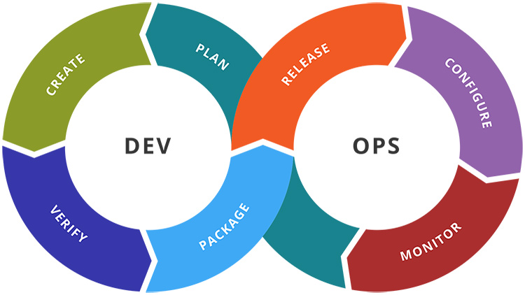

####################
Overview of Devops
####################

DevOps automates and speeds software delivery. It makes your process and your products more reliable. When you implement DevOps 
technologies and practice, you will provide value to your customers faster—in the form of new and innovative products or enhancements 
to existing ones.

Why DevOps?
-----------

The main reason behind DevOps' popularity is that it allows enterprises to create andimprove products at a faster pace than traditional 
software development methods.

1) Shorter Development Cycles, Faster Innovation
+++++++++++++++++++++++++++++++++++++++++++++++++

When we have a biased response from the development and operations teams, it is often difficult to tell if the application is operational.
When development teams simplysubmit a request, the cycle times are unnecessarily extended.

With joint development and operations efforts, the team's applications are ready to use more quickly. This is important because companies 
succeed on the basis of their ability to innovate faster than their competitors.

2) Reduce Implementation Failure, Reflections and Recovery Time
++++++++++++++++++++++++++++++++++++++++++++++++++++++++++++++++

The main reason for the failure of the teams in the implementation failure is due to programming defects. With shorter development cycles, 
DevOps promotes frequent code versions. This, in turn, makes it easy to detect code defects. Therefore, teams can use their time to reduce
the number of implementation failures using agile programming principles that require collaboration and standard programming. Recovery time
is an important issue because you should expect some failure. But recovery is much faster when development teams and operations work 
together to share ideas and take into account the challenges of both teams during development.

2) Better Communication and Cooperation
++++++++++++++++++++++++++++++++++++++++

Improved DevOps software development culture. The common teams are happier and more productive. Culture focuses on performance rather 
than individual goals. When teams trust each other, they can experiment and innovate more effectively. Teams can focus on bringing the
product to market or production, and their key performance indicators must be organized accordingly.

It no longer involves "passing" the application to the processes and waiting to see what is happening. Processes do not need to wait for
a different team to solve a problem. The process becomes increasingly transparent as all individuals work towards a common goal.

4) Greater Competencies
++++++++++++++++++++++++

High efficiency helps accelerate development and makes it less prone to errors. There are ways to automate DevOps tasks. Continuous 
integration servers automate the code testing process, reducing the amount of manual work required. This means that software engineers 
can focus on completing tasks that can not be automated.

Speeding up tools are another chance to increase efficiency. For example:

The scalable infrastructure, such as cloud-based platforms, increases the team's access to hardware resources. As a result, testing and 
deployment are accelerated.

Acceleration tools can be used to compile code more quickly.

Parallel workflows can be integrated into the continuous delivery chain to avoid delays; one more team is expected to complete its work.

Using an environment avoids a useless task of transferring data between environments. This means that you do not have to use a 
development environment, a different testing environment, and a third implementation.

5) Reduce Costs and IT Staff
+++++++++++++++++++++++++++++

All the benefits of DevOps translate into reduced general costs and requirements of IT staff. DevOps development teams require IT staff 
to be 35 percent less and IT costs 30 percent lower.

What id DevOps?
----------------

DevOps is a practice that unifies people, process and technology across development and IT in five core practices: planning and tracking,
development, build and test, delivery and monitoring and operations. When practicing DevOps, development, IT operations, quality 
engineering and security teams work closely together—breaking down practices that were once siloed. Improved coordination and 
collaboration across these disciplines reduces the time between when a change is committed to a system and when the change being placed 
into production. And, it ensures that standards for security and reliability are met as part of the process. The result: better products,
delivered faster, to happier customers.

DevOps Market Trends
---------------------

DevOps as an approach to software development has become widely established over the last nine years. Bringing the development and IT 
operations functions together has brought many benefits in the form of better communication and increased collaboration and we’ve seen a
range of new tools and disciplines emerging to support the movement. Looking ahead, I’d like to explore five DevOps trends on the horizon 
for 2019.

1) DevOps to NoOps
++++++++++++++++++++

The move to NoOps (No Operations) is gathering pace and is likely to accelerate in the coming year. Usually, when we want to consume an 
IT resource like a test environment, we depend on a separate operations team to process the request on our behalf. This can lead to 
frustration as we wait for the request to be serviced. With NoOps, the operations team make this experience more seamless. This is 
achieved with intelligent automation that enables self-service, empowering the business, and creating transparency of the operations
team managing it.
As a result, you can consume IT resources directly and without waiting. This allows different personas within the business to improve
their productivity.

2) Integration of AI and DevOps
+++++++++++++++++++++++++++++++++

DevOps is becoming more data-driven. The dramatic rise in applications delivered through a cloud-based Software-as-a-Service model means
that organizations are collecting ever more data on how people are interacting with applications but also on how those applications are
being delivered. Using this data, key insights into an organization’s delivery throughput and stability can now be measured using metrics
such as deployment frequency and lead time for changes, as well as time to restore a service and change failure rate, respectively. This
is an area that is ripe for AI and Machine Learning. Applying machine learning to the software delivery lifecycle will allow organizations 
to analyze and understand where bottlenecks, blockages, or capacity issues are occurring, or are likely to occur in the future. This will
allow for predictive suggestions to streamline and optimize delivery accordingly.

I expect to see AI and data science experts working much more closely with DevOps teams in 2019 to deliver increased efficiencies and
greater insights to the software delivery and testing process. This alignment is crucial in allowing organizations to act much more 
quickly in delivering the new functionality and features that customer want.

3) Integrated Security: DevSecOps
++++++++++++++++++++++++++++++++++

DevSecOps will also gain further momentum in 2019. The growing "Shift-Left" mindset in DevOps means that instead of treating security as
an afterthought at the end of the delivery process, the emphasis is on writing code securely first-time round. Embedding product and 
operations security concerns into the continuous delivery pipeline at the earliest possible stage, makes the testing and remediation 
cycle much faster.

In 2019, I expect organizations to work with their security teams to take advantage of security tools and platforms to embed security
polices into an automated and integrated DevSecOps environment. Such an environment can automatically detect security vulnerabilities,
and quickly assess whether or not code can safely progress to a customer-facing environment using quality gates. It’s all about enabling
throughput of value to customers, but not at the cost of security.

4) Growth in Containerized Microservices
+++++++++++++++++++++++++++++++++++++++++

Microservices are an effective way for organizations to deliver features to customers, as the approach allows a larger system to be 
broken into independent, loosely coupled constituents that can be delivered and run using containers, which are lightweight and offer 
isolation. The combination act as a rapid means to deliver change.

As organizations seek to become more Agile, so, too, will their adoption of containerized microservices. This, in turn, is driving the 
adoption of open source platforms like Google’s Kubernetes. I expect this trend to continue – along with increased use of Functions-as 
a-service. Traditionally, developers depend on provisioned infrastructure on which to run their services, but major cloud computing 
services are making that infrastructure disappear for the developer. Now, developers can write a cloud-native “serverless” function 
without having to consider where it runs or the infrastructure it runs upon. Cloud-based functions have their limitations, but as they
mature, so will their applicability to solve more complex problems.

5) Increased Focus on Continuous Delivery
++++++++++++++++++++++++++++++++++++++++++

The uptake of a Continuous Delivery approach to software development should increase across large enterprises next year. This comes as 
leadership teams increasingly recognize the correlation of the key technical practices that make up continuous delivery with overall 
business performance and organizational engagement.  The in-depth insight shared from DevOps surveys such as Puppet and Splunk’s 2018 
State of DevOps Report, show how IT can become a driver of business performance going forward rather than be seen a cost centre to the 
business. This change in mindset will gather pace in 2019.

To sum up, it’s certainly an exciting time to be involved in the world of DevOps and the pace of change is unlikely to let up any time 
soon! I relish the opportunities that lie ahead – and particularly the way in which the world of software development is being opened up
to a wider audience with people collaborating more effectively through changes like NoOps, Low Code and Platform-as-a-Service. I look 
forward to seeing the landscape evolve further over the coming year.

DevOps Engineer Skills
-----------------------

.. image:: images/chapter1/skills.PNG
  :width: 400px
  :height: 200px
  :alt: alternate text

The aim of using DevOps is to alter and improve the relationship between development and IT operations, advocating better communication
and collaboration between the two units. Although it may seem somewhat simple, there is much more needed from a DevOps engineer to 
successfully deploy the code and bind the two units together successfully.

Following are the skills reqired :

1) Flexibility
+++++++++++++++

Coding is an on-going process, ever changing and always needing updating. To be a successful and effective DevOps engineer the ideal candidate must have the ability to continuously develop and integrate new systems and operations into the code. A DevOps engineer must have flexible working skills and adapt to the changing code.
Engineers must be comfortable moving from one area of software construction to another, be it integration, testing, releasing or deployment.
Continuous Integration, for example, requires the technical skills to manage change quickly and efficiently, as well as being able to work collaboratively in a team to guarantee everyone is working towards the same goal.

2) Security Skills
+++++++++++++++++++

As with many other skilled areas security is always of the utmost importance, especially in coding. An easy way for hackers to get into systems is through vulnerabilities, undermining the system that is in place to get to the data.
   A DevOps engineer must have security skills when being employed because it is paramount to build-in secure software from the start of deployment, as opposed to adding it in later. If security is not in place from the outset then here is more chance that hackers could write in damaging code to the network. Therefore, when recruiting for the next DevOps engineer ensure security is on the top of the list of skills.
   
3) Collaboration
+++++++++++++++++

When it comes to a successful DevOps engineer, the ability to perform as a one-man band will not pass muster – collaboration is in fact central to the DevOps concept, bringing together software development and software operation. A DevOps engineer must have the ability to work in a team, with collaboration providing more cross-functionality within the DevOps process.

4) Scripting Skills
++++++++++++++++++++

Though it may sound obvious, any developer must have high-quality skills in scripting code. Whether its JavaScript, Python, Perl, or Ruby, a successful DevOps engineer must be able to write code.

From writing manual code to replacing manual processes such as assigning IP addresses or DNS codes, there must be someone with the ability to write them and that’s what the perfect candidate should be able to do.

5) Decision-making
+++++++++++++++++++

An indecisive candidate is not one that you want for your business DevOps engineer. The successful candidate will have the ability to confidently and quickly make a decision is the hustle-bustle environment a DevOps engineer works in.

The ever-changing nature of code brings the necessity to quickly make the decision on how to fix any incoherent elements of the code. Decisiveness must be an element to consider when employing a DevOps engineer, because making quick decisions allows engineers to maintain the ability of rapid development and deployment of new coding changes.

6)  Infrastructure Knowledge
+++++++++++++++++++++++++++++

Scripting is just one of the key skills a developer should have, just ahead of cloud and infrastructure experience. Engineers should have a working understanding of data centre-based and cloud infrastructure components. This includes elements such as how software is networked to running virtual networks.

Without the ability to understand infrastructure it could prove somewhat difficult to be the full package DevOps engineer. Incorporating infrastructure skills will enable an effective DevOps engineer to design and deploy applications effectively using the best of the best platforms.

7) Soft Skills
+++++++++++++++

As mentioned above being a DevOps engineer is no one-man job, so in that case, any future employee must have soft skills as well as technical. Bound on trust, DevOps culture enables all workers to be communicative and understanding to the process and if changes need to be made.

When developers communicate with each other effectively, applications can be delivered in a much shorter period of time than if some workers were absent to information. As well as quicker market deployment, having good communication will lead to fewer errors and therefore lower costs and improve the quality of code.

Devops Delivery Pipeline
-------------------------

Every organization has a deployment pipeline. They may not call it that, but to get their application from concept to production, they all work through steps that become sequential and eventually routine.

The benefit of defining a pipeline is:

1) Knowing what you have
 
2) Knowing what you don’t have
 
3) Knowing your bottlenecks
 
4) Seeing your whole operation in one place
 
5) And finally having an opportunity to improve

Pipeline components are often very similar:

1) Plan
 
   a. Roadmap
 
   b. Tickets
 
   c. Backlog
 
2) Code
3) Build
4) Test

   a. Unit Test
 
   b. Integration Test
 
   c. Functional Test
 
5) Release

   a. To Staging
 
   b. To Production

Creating, documenting, and building conversations around your delivery pipeline are the best way to transition teams to DevOps. This will slowly but surely enhance your development processes.

Devops Echosystem
------------------

you can see the complete DevOps ecosystem infographic here:

   
1) Plan
++++++++

Planning is the initial stage, and it covers the first steps of project management. The project and product ideas are presented and analyzed, in groups, alone, or on whiteboards. The developer, team, and organization decide what they want and how they want it and assign tasks to developers, QA engineers, product managers, etc. This stage requires lots of analysis of problems and solutions, collaboration between team members, and the ability to capture and track all that is being planned.

2) Devlop
++++++++++

Developing is the stage where the ideas from planning are executed into code. The ideas come to life as a product. This stage requires software configuration management, repository management and build tools, and automated Continuous Integration tools for incorporating this stage with the following ones.

3) Test
++++++++

A crucial part that examines the product and service and makes sure they work in real time and under different conditions (even extreme ones, sometimes). This stage requires many different kinds of tests, mainly functional tests, performance or load tests, and service virtualization tests. It’s also important to test compatibility and integrations with third-party services. The data from the tests needs to be managed and analyzed in rich reports for improving the product according to test results.

4) Release
+++++++++++

Once a stage that stood out on its own and caused many a night with no sleep for developers, now the release stage is becoming agile and integrating with the Continuous Delivery process. Therefore, the discussion of this part can’t revolve only around tools, but rather needs to discuss methodologies as well. Regarding tools, this stage requires deployment tools.

5) Operate
+++++++++++

We now have a working product, but how can we maximize the features we’ve planned, developed, tested, and released? This is what this stage is for. Implementing the best UX is a big part of this, monitoring infrastructure, APMs, and aggregators, and analyzing Business Intelligence (BI). This stage ensures our users get the most out of the product and can use it error-free.

